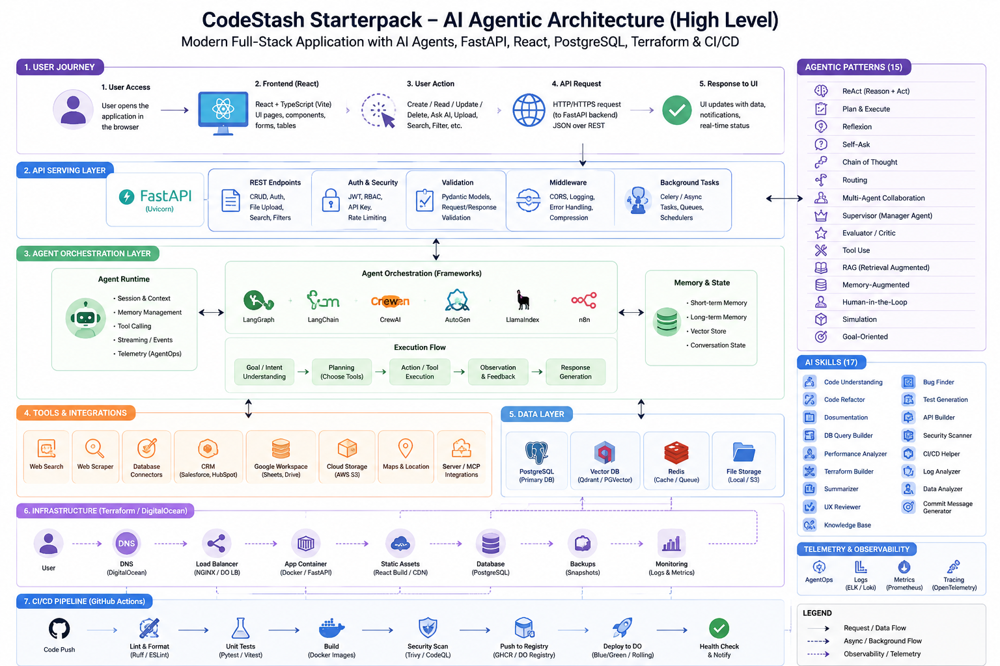

# CodeStash Starterpack

[](https://fastapi.tiangolo.com/)
[](https://vite.dev/)
[](https://www.postgresql.org/)
[](https://www.terraform.io/)
[](LICENSE)

CodeStash Starterpack is a production-minded full-stack starter kit for building modern web applications with FastAPI, React, TypeScript, PostgreSQL, Docker, Terraform, and GitHub Actions. It is intentionally generic, clean, and reusable, so you can turn it into a SaaS product, internal dashboard, CRUD platform, admin console, marketplace, automation tool, or domain-specific app without first deleting opinionated business logic.

It gives you the boring-but-critical foundation: an async API, typed frontend, reusable form and status components, paginated CRUD flow, PostgreSQL persistence, Docker Compose local development, DigitalOcean Terraform modules, CI checks, and 17 AI-powered agent skills that make coding assistants disciplined, project-aware, and consistently excellent.

It also ships an agent generator. `python3 cli.py` asks which LLM provider, orchestration framework
and agentic pattern you want, then writes an agent module against that framework's **real SDK** —
8 providers × 6 frameworks × 15 patterns, with only the chosen stack's dependencies installed.



## Contents

- [Architecture](#architecture)
- [Tech Stack](#tech-stack)
- [Quick Start](#quick-start)
- [Generating a Project](#generating-a-project)
  - [Supported Providers](#supported-providers)
  - [Supported Frameworks](#supported-frameworks)
  - [Supported Patterns](#supported-patterns)
  - [Generated Agent Layout](#generated-agent-layout)
- [Project Structure](#project-structure)
- [API Reference](#api-reference)
- [Local Development](#local-development)
- [Infrastructure](#infrastructure)
- [AI Skills](#ai-skills)
- [CI/CD](#cicd)
- [Production Checklist](#production-checklist)
- [Best For](#best-for)

## Architecture

Seven layers, each independently replaceable. The agent orchestration layer is the only part the
generator rewrites per selection; everything above and below it stays the same.

| Layer | Responsibility |
| --- | --- |
| User journey | React + TypeScript pages, forms, and tables calling the API over REST |
| API serving | FastAPI routers, Pydantic validation, auth, middleware, background tasks |
| Agent orchestration | The generated `agent/` package — runtime, execution flow, memory and state |
| Tools & integrations | MCP servers, search, scrapers, storage, and third-party connectors |
| Data | PostgreSQL primary store, optional vector DB, cache, and file storage |
| Infrastructure | DigitalOcean Terraform modules for DNS, load balancer, app, DB, backups |
| CI/CD | GitHub Actions: lint, tests, build, security scan, registry push, deploy |

## Tech Stack

| Layer | Technology |
| --- | --- |
| Backend | FastAPI, Uvicorn, SQLAlchemy asyncio, asyncpg, Pydantic Settings |
| Frontend | React 19, TypeScript, Vite 6, React Router, lucide-react |
| Database | PostgreSQL 16 |
| Local Runtime | Docker Compose |
| Python Tooling | uv, pytest, pytest-asyncio, HTTPX, Ruff |
| JavaScript Tooling | npm, TypeScript, ESLint, Vite build pipeline |
| Infrastructure | Terraform, DigitalOcean modules |
| Automation | GitHub Actions CI and Terraform validation |
| Agent Tooling | Shared `backend/app/agentic` runtime, AgentOps telemetry, `.agent/skills`, `skill.update.py`, `skills.json` |

## Quick Start

### 1. Clone and Configure

```bash
git clone <your-repo-url>
cd codestash-starterpack
cp backend/.env.example backend/.env
cp frontend/.env.example frontend/.env
```

Default local configuration:

```bash
# backend/.env
APP_NAME=CodeStash API
ENV=development
DATABASE_URL=postgresql+asyncpg://codestash:codestash@db:5432/codestash
CORS_ORIGINS=http://localhost:5173

# frontend/.env
VITE_API_URL=http://localhost:8000    # browser-facing, production builds only
DEV_PROXY_TARGET=http://localhost:8000 # dev-server proxy target (compose overrides to http://backend:8000)

# Optional observability
AGENTOPS_ENABLED=false
AGENTOPS_API_KEY=
```

> `VITE_API_URL` is resolved by the **browser**; `DEV_PROXY_TARGET` is resolved by the **Vite dev
> server**. Inside Docker they differ, which is why they are two variables.

### 2. Start the Full Stack

```bash
docker compose up --build
```

### 3. Open the App

| Service | URL |
| --- | --- |
| Frontend | `http://localhost:5173` |
| Backend API | `http://localhost:8000` |
| API Docs | `http://localhost:8000/docs` |
| PostgreSQL | `localhost:5432` |

## Generating a Project

```bash
python3 cli.py
```

The generator asks for a project name, an LLM provider, an orchestration framework, an agentic
pattern and any MCP servers, then writes a complete repository. Only the stack you chose is
shipped — there is no runtime `if framework == ...` switch and no unused provider adapters.

Concretely, your answers decide three things:

1. **`backend/app/agentic/agent/agent.py`** — generated against the real SDK of the framework you picked.
2. **`backend/pyproject.toml`** — the `agentic` extra contains only the packages that stack needs.
3. **`backend/.env`** — the provider's own environment variable names, pre-filled.

### Supported Providers

Eight providers, each with its own credential and endpoint variables:

| Provider | Default model | API key variable | Base URL variable | Base URL default |
| --- | --- | --- | --- | --- |
| `openai` | `gpt-4o` | `OPENAI_API_KEY` | `OPENAI_BASE_URL` | provider default |
| `gemini` | `gemini-2.5-pro` | `GEMINI_API_KEY` | `GEMINI_BASE_URL` | provider default |
| `anthropic` | `claude-sonnet-4-20250514` | `ANTHROPIC_API_KEY` | `ANTHROPIC_BASE_URL` | provider default |
| `groq` | `llama-3.3-70b` | `GROQ_API_KEY` | `GROQ_BASE_URL` | `https://api.groq.com/openai/v1` |
| `openrouter` | `openai/gpt-4o` | `OPENROUTER_API_KEY` | `OPENROUTER_BASE_URL` | `https://openrouter.ai/api/v1` |
| `azure-openai` | `gpt-4o` | `AZURE_OPENAI_API_KEY` | `AZURE_OPENAI_ENDPOINT` | your resource endpoint |
| `ollama` | `llama3` | `OLLAMA_API_KEY` | `OLLAMA_BASE_URL` | `http://localhost:11434/v1` |
| `openai-compatible` | `qwen2.5-coder` | `OPENAI_COMPATIBLE_API_KEY` | `OPENAI_COMPATIBLE_BASE_URL` | your gateway URL |

### Supported Frameworks

Six frameworks. The generated module imports and calls each one's actual SDK — no hand-rolled
agent loop, no wrapper layer:

| Framework | Package installed | SDK constructs used in the generated code |
| --- | --- | --- |
| `langchain` | `langchain` + provider binding | `create_agent`, LCEL (`prompt \| model \| StrOutputParser`), `RunnableParallel` |
| `langgraph` | `langgraph` + provider binding | `create_react_agent`, `StateGraph`, `MessagesState`, `START` / `END` |
| `openai-agents` | `openai-agents` (`[litellm]` for Gemini/Anthropic) | `Agent`, `Runner`, `ModelSettings`, `function_tool`, `handoffs`, `OpenAIChatCompletionsModel`, `LitellmModel` |
| `google-adk` | `google-adk` (+ `litellm` for non-Gemini) | `LlmAgent`, `SequentialAgent`, `LoopAgent`, `ParallelAgent`, `Runner`, `InMemorySessionService`, `LiteLlm` |
| `crewai` | `crewai` + the provider's extra (`[anthropic]`, `[google-genai]`, `[azure-ai-inference]`, `[litellm]`) | `Agent`, `Task`, `Crew`, `Process.sequential`, `Process.hierarchical`, `LLM` |
| `strands` | `strands-agents[<provider>]` | `Agent`, `@tool`, `OpenAIModel` / `GeminiModel` / `AnthropicModel` / `OllamaModel` |

Provider bindings for the LangChain family are `langchain-openai`, `langchain-google-genai` or
`langchain-anthropic` depending on your provider choice.

### Supported Patterns

Fifteen patterns. Each one produces a different topology and a different set of named roles, all
expressed in the chosen framework's own primitives:

| Pattern | Topology | Roles |
| --- | --- | --- |
| `react` | single | one tool-using agent |
| `tool-use` | single | one tool-using agent |
| `autonomous` | single | one tool-using agent |
| `rag` | single | one retrieval-augmented agent |
| `sequential` | pipeline | researcher → analyst → writer |
| `planner-executor` | pipeline | planner → executor |
| `planning` | pipeline | strategist → planner → executor |
| `reflection` | loop (2 rounds) | drafter → critic → reviser |
| `reviewer-critic` | loop (2 rounds) | author → reviewer → editor |
| `parallel` | fan-out + merge | factual ∥ risk ∥ practical |
| `swarm` | fan-out + merge | explorer ∥ optimizer ∥ validator |
| `debate` | fan-out + merge | proponent ∥ opponent |
| `hierarchical` | supervisor | researcher / analyst / writer |
| `coordinator` | supervisor | intake / specialist / reporter |
| `blackboard` | supervisor | observer / reasoner / resolver |

How a topology is expressed depends on the framework. `sequential`, for example, becomes a
`SequentialAgent` under Google ADK, a `StateGraph` chain under LangGraph, chained `Task`s under
CrewAI, and a list of agents driven by `Runner.run` under OpenAI Agents.

### Generated Agent Layout

```text
backend/app/agentic/
|-- __init__.py
|-- config.py         # env-backed AgentConfig
|-- agent/
|   |-- __init__.py   # re-exports Agent, AgentResult, root_agent
|   `-- agent.py      # provider binding + framework topology + root_agent
|-- mcp/              # MCP server wiring
|-- memory/           # conversation + vector memory backends
`-- telemetry/        # tracing and AgentOps export
```

`agent.py` exposes three seams, so you can change one concern without touching the others:

| Function / class | Responsibility |
| --- | --- |
| `build_model(config)` | Binds the selected provider to the selected framework |
| `build_runtime(config)` | Assembles the pattern topology from framework primitives |
| `Agent` | Adapts that runtime to `run()` / `stream()` / `chat()` |

Use it directly:

```python
from app.agentic.agent import root_agent

result = await root_agent.run("Summarise the latest release notes")
print(result.final_output, result.steps, result.duration_ms)

async for chunk in root_agent.stream("Draft a changelog"):
    print(chunk, end="")
```

Or inspect the live configuration over HTTP:

```bash
curl localhost:8000/api/agent              # provider, framework, pattern, telemetry
curl "localhost:8000/api/agent?probe=true" # also round-trips one call to the model
```

## Project Structure

```text
.
|-- backend/
|   |-- app/
|   |   |-- agentic/        # agent runtime (see above)
|   |   |-- api/            # HTTP layer: items.py, health.py, schemas.py
|   |   |-- services/       # business logic
|   |   |-- repositories/   # data access + SQLAlchemy models and session
|   |   |-- config.py       # pydantic-settings
|   |   `-- main.py         # app wiring, lifespan, middleware, routers
|   |-- tests/
|   |-- Dockerfile
|   `-- pyproject.toml
|-- frontend/
|   |-- src/
|   |   |-- components/     # Layout and shared UI
|   |   |-- pages/          # Home dashboard, Items CRUD
|   |   `-- lib/api.ts      # typed API client
|   |-- Dockerfile
|   `-- vite.config.ts
|-- terraform/              # DigitalOcean modules
|-- .agent/                 # agent skills, MCP config, skills.json
|-- .github/workflows/      # CI + Terraform validation
|-- cli.py                  # project generator
|-- agent_module.py         # renders app/agentic/agent/ per framework
`-- docker-compose.yml
```

The backend follows a **Controller → Service → Repository → Model** flow. `app/api/items.py` is the
reference resource: copy it, its service and its repository when adding a new entity.

## API Reference

| Method | Path | Description |
| --- | --- | --- |
| `GET` | `/api/health` | Liveness probe for load balancers |
| `GET` | `/api/status` | App version plus database connectivity |
| `GET` | `/api/agent` | Provider, framework, pattern, memory and telemetry state |
| `GET` | `/api/agent?probe=true` | The above, plus one live round-trip to the model |
| `GET` | `/api/items` | Paginated list — `page`, `limit`, optional `status` |
| `POST` | `/api/items` | Create an item |
| `GET` | `/api/items/{id}` | Fetch one item |
| `PATCH` | `/api/items/{id}` | Partial update — only sent fields change |
| `DELETE` | `/api/items/{id}` | Delete an item |

Timestamps are serialised as UTC ISO-8601 with a trailing `Z`.

## Local Development

### Backend

```bash
cd backend
uv sync --extra dev --extra agentic
make dev
```

Useful backend commands:

```bash
make install   # uv sync with the dev and agentic extras
make dev       # run FastAPI with reload on port 8000
make test      # run pytest
make lint      # run Ruff checks
make format    # apply Ruff formatting
```

### Frontend

```bash
cd frontend
npm install
npm run dev
```

Useful frontend commands:

```bash
npm run dev      # start Vite on port 5173
npm run build    # type-check and build production assets
npm run preview  # preview production build
npm run lint     # run ESLint
```

## Infrastructure

Terraform is configured for DigitalOcean and split into reusable modules:

- `terraform/modules/droplet` creates or references compute infrastructure
- `terraform/modules/firewall` manages network access
- `terraform/modules/project` organizes resources under a DigitalOcean project

Start with the example variables file:

```bash
cd terraform
cp terraform.tfvars.example terraform.tfvars
terraform init
terraform fmt -recursive
terraform validate
```

Important variables include `digitalocean_token`, `create_droplet`, `droplet_region`, `droplet_size`, `ssh_key_ids`, `create_firewall`, and project metadata.

## AI Skills

CodeStash ships with a rich set of agent skills in `.agent/skills/`. Each skill is a `SKILL.md` file with YAML frontmatter and a step-by-step methodology that activates automatically when the AI agent encounters a matching task. Skills turn a generic code assistant into a disciplined, project-aware collaborator that follows consistent processes for architecture, debugging, testing, infrastructure, and more.

The `.agent` directory keeps these skills versioned with the project. Sources are listed in `.agent/skills.json` using direct GitHub URLs, and the `skill.update.py` CLI handles syncing.

```bash
python3 .agent/skill.update.py sync         # sync all skills from skills.json
python3 .agent/skill.update.py add <url>    # add a single skill from a GitHub URL
python3 .agent/skill.update.py list          # show installed skills
python3 .agent/skill.update.py check         # validate frontmatter
python3 .agent/skill.update.py bump <name>   # bump patch version
```

### What Each Skill Does for the Agent

#### Built-in Engineering Skills

| Skill | How It Helps the Agent |
| --- | --- |
| **agent-setup** | Bootstrap the project's agent context. Creates the `## Agent skills` block in `CLAUDE.md` / `AGENTS.md` and `docs/agents/` so that all other skills know the repo's issue tracker, triage labels, and domain documentation. Run this first before using `feature-split`, `issue-triage`, `bug-hunt`, or `arch-review`. |
| **arch-review** | Find deepening opportunities in a codebase. The agent scans for tightly-coupled modules, missing abstractions, and refactoring targets informed by `CONTEXT.md` and ADRs. Triggers when you ask to improve architecture, consolidate modules, or make code more testable. |
| **bug-hunt** | Disciplined diagnosis loop for hard bugs and performance regressions. The agent follows reproduce, minimise, hypothesise, instrument, fix, regression-test. Triggers on "diagnose this", "debug this", or reports of broken/failing behaviour. |
| **doc-drill** | Stress-tests your plan against the existing domain model and documentation. The agent challenges assumptions, sharpens terminology, and updates `CONTEXT.md` and ADRs inline as decisions crystallise. Triggers when you want to validate a plan before implementing. |
| **feature-split** | Converts a feature request, PRD, or free-form description into a set of vertical-slice issues ordered by dependency, ready to be worked on. Triggers when breaking down a feature into actionable issues or creating issues from a requirement document. |
| **git-safety** | Installs a git pre-tool-call hook that blocks destructive commands like `push`, `reset --hard`, `clean -f`, and `branch -D` without confirmation. Triggers when you want to prevent accidental destructive git operations. |
| **issue-triage** | Triages an issue through a state machine: classifies as bug or enhancement, assesses it against project scope, rewrites it to AGENT-BRIEF spec if ready, and applies the correct triage label. Every triage comment includes a disclosure note. Triggers on incoming issues or backlog review. |
| **module-map** | Goes up a layer of abstraction and returns a map of relevant modules and callers using the project's domain vocabulary. Triggers when you are unfamiliar with an area of code and want orientation: "I don't know this area", "give me an overview", "what calls what here". |
| **precommit-setup** | Installs and configures a pre-commit hook using Husky and lint-staged that runs Prettier, TypeScript type-checking, and tests before every commit. Triggers when setting up a new repo, adding pre-commit hooks, or configuring Prettier and lint-staged. |
| **skill-forge** | Guides the user through creating a new Agent Skill from scratch. Covers SKILL.md structure, frontmatter, and methodology. Triggers when you want to author, design, or write a new skill. |
| **skill-scaffold** | Creates a new agent skill with the required frontmatter plus optional reference files (`REFERENCE.md`, `EXAMPLES.md`, `scripts/`). Gathers requirements, drafts the skill, and validates it against description constraints. Triggers when you want to save a workflow as a reusable skill. |
| **test-cycle** | Guides test-driven development through public interfaces rather than implementation internals. Enforces planning, tracer-bullet approach, and incremental RED-GREEN-REFACTOR cycles. Triggers when writing new features with tests, or when tests are entangled with internal details. |
| **tf-add** | Generates and wires Terraform resources and modules for any cloud provider. The agent creates resource files, connects outputs across modules, sets up remote state, and writes tests. Triggers when adding Terraform resources, generating modules, or building CI/CD pipelines for Terraform. |

#### Synced Community Skills

These skills are synced from GitHub repositories via `.agent/skills.json` and bring specialist knowledge into the agent's workflow.

| Skill | Source | How It Helps the Agent |
| --- | --- | --- |
| **fastapi** | `fastapi/fastapi` | Official FastAPI skill. The agent follows best practices for `Annotated` parameters, dependency injection, return-type validation, router organization, async/sync path operations, streaming, and tooling like `uv` and `Ruff`. Keeps FastAPI code clean and idiomatic. |
| **agentscope** | `agentscope-ai/agentscope` | A2UI response generation. The agent retrieves UI JSON schematics and templates that best represent a response before generating A2UI (Agent to UI) JSON. Essential for building conversational agents that render structured UI responses. |
| **ui-ux-pro-max** | `nextlevelbuilder/ui-ux-pro-max` | UI/UX design intelligence across React, Next.js, Vue, Svelte, and more. The agent draws from 50+ styles, 161 color palettes, 57 font pairings, 99 UX guidelines, and 25 chart types to plan, build, review, and fix production-quality interfaces. |
| **antigravity-awesome-skills** | `sickn33/antigravity-awesome-skills` | Comprehensive README generation. The agent creates absurdly thorough project documentation: the kind of README you wish every project had. Triggers when you need to write or improve project documentation. |

### How Skills Activate

Skills are prompt-based and context-aware. When you ask the agent to do something that matches a skill's description, the skill's methodology is loaded automatically. For example:

- Saying "debug this" activates **bug-hunt** and the agent follows its structured diagnosis loop
- Saying "break this feature into issues" activates **feature-split** and produces ranked vertical-slice issues
- Saying "review the architecture" activates **arch-review** and scans for coupling and deepening opportunities
- Saying "add a Terraform resource for S3" activates **tf-add** and generates the module, variables, and outputs

No manual activation needed. Just describe what you want, and the right skill's process kicks in.

## CI/CD

GitHub Actions are included for the most important checks:

- `.github/workflows/ci.yml` runs backend Ruff + pytest and frontend production build
- `.github/workflows/terraform.yml` runs Terraform fmt, init, and validate for infrastructure changes

CI runs on pushes to `main`, `master`, and `dev`, plus pull requests. Terraform validation runs on pull requests that touch Terraform files or the Terraform workflow.

## Production Checklist

- Replace all placeholder environment values before deployment
- Use strong database credentials and a managed secret store
- Restrict `CORS_ORIGINS` to trusted frontend domains
- Point `VITE_API_URL` at the public API origin; `DEV_PROXY_TARGET` is dev-server-only and unused in a production build
- Disable development-only API docs in production through `ENV=production`
- Review Terraform firewall rules and avoid broad SSH allow lists
- Configure a managed PostgreSQL instance or persistent production database strategy
- Add authentication, authorization, rate limiting, and audit logging for real products
- Expand tests around new services, repositories, and user-facing workflows

## Best For

CodeStash Starterpack is a strong base for full-stack web application development, FastAPI React starter projects, SaaS boilerplates, admin dashboards, CRUD applications, internal tools, Terraform-backed cloud apps, and AI-assisted coding workflows.

## License

Released under the [MIT License](LICENSE). Generated projects also ship with their own MIT `LICENSE` file, so you are free to use, modify, and distribute them commercially.
